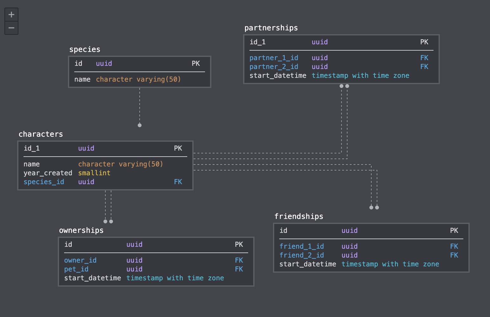

Approach 1:

Issues:

- What if other info about a character changes? (marriage!)
- What about characters with more than one friend?

Approach 2:

Issues:
- there aren't keys here
- different attributes, goes against 1NF!
- isn't capturing relationships other than in text 

Approach 3:

Issues:
- friends as an array poses all sorts of issues w/r/t CRUDing them, esp as they are their own independent entities. goes again 5NF

Could you develop a better model?

thoughts:
- you would have code-level enforcement of the species type
- all relationships have start dates (in the real world relationships have applicable time windows so this gives us flexibility if Minnie leaves Mickey...)
- i could have made a generic 'relationships' table and specified the 'type' (ex. marriage, friendship, child, etc). and given that these characters have not changed much in the last 100 years that might be better bc it doesn't require a separate query for friends vs partner vs pet. i didn't because they *are* distinct relationships and then there's added complexity of understand which way the relationship goes (ex. who is the child and who is the parent?)
- given everything i just said and the very small size of the Disney world I'd probably store all this info in a YAML file :P