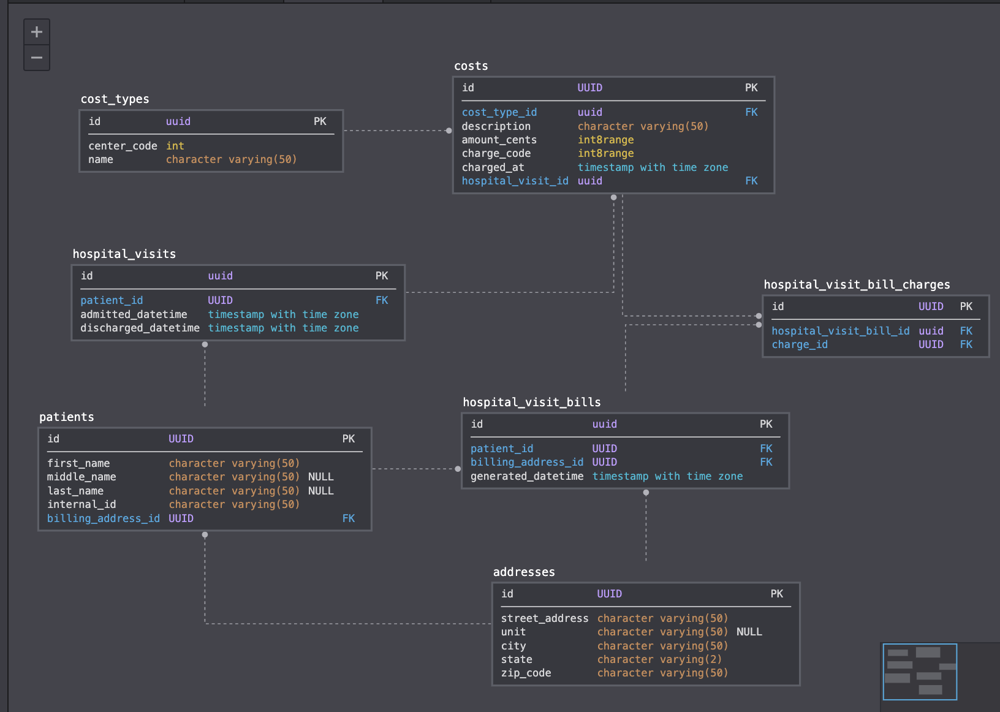

Thoughts:
- subtotaling + grouping is a display concern (this model supports it)
- even though the `Patient` has a `BillingAddress`, it's reasonable to expect it to change and the patient bill table should allow us to reproduce all the information that was on the original generated bill. We'd want to give more thought to whether this applies to *most* data about a person (ex. name after marriage).
- To get around all edge-cases from ^ / in general, it'd be reasonable to store the generated bill and have the `HospitalVisitBill` contain a reference
- I wasn't clear on what Cost Name / Code were. They may be well-suited for a YAML file rather than a database if it's static info we only intend to read. In this case `Cost` would store a `cost_code` value directly and we could lookup the 'name' in that YAML file.
- I've seen money represented as cents (thereby supporting multiple currencies and preventing unexpected conversions). I've also heard arguments for using the types languages provide (ex. `BigDecimal` in `Java` which could be represented using the `decimal` type in Postgres). `integer`'s max val would be $21,474,836.47 which may or may not be a reasonable upper-threshold for a US medical procedure :p. In that case we could use `bigint` and get up to $92,233,720,368,547,758.08 but that's bytes of wasted space for a table likely to be larger than any other in this system.
- This is US-skewed (addresses schema)