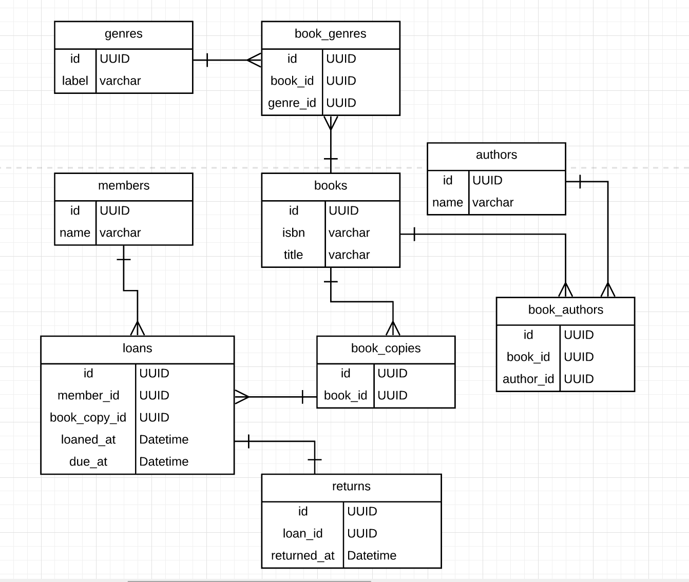

Exercise:
_consider a library where members are able to borrow and return books: model this scenario with various degrees of normalization and describe the pros and cons of each approach._

Form 1

You could violate Form 1 by having a `Loan` record that does not have a `returned_at` field (at all, vs being nil). By
design you can't do this in a relational database. 

Form 2

You could violate Form 2 by having a composite key `Member|Loan` which contained information about a `Book` `title`. This
would allow us to display the `title` of the `Book` without having to query the `BookCopy` and then `Book` table, but will
lead to issues of duplicating + maintaining the `title`.

Form 3

Similar to ^, the `BookCopy` table could directly contain the `Book` `title` but then we have a non-key field (`title`) 
which is storing information about another non-key field (`book_id`). This will lead to similar issues as described for
Form 2 above.

Form 4

You could violate Form 4 by having `genre` and `author` directly on `Book`. A `Book` can have many `Genre`s and also have
many `Author`s. By making them a part of the record type you lead to:
- duplication of information about `Book`s
- lack of information on whether a pulled `Book` record has *only* the given `Author` or `Genre` (including if that value
is blank)
- incorrect implication that `Genre` + `Author` are interdependent

Form 5

You could violate form 5 by storing `Genre` information on the `Book` table.

Other thoughts:

__1.__ `Return`s could be a field on the `Loan`s table that's just a datetime.

Pros:
- saves a query
- we don't have any other information on the table besides a datetime

Cons:
- feels wrong. in the real world the action of loaning a book and returning a book are completely separate which means there
could reasonably be separate information stored about them (ex. which location the book was loaned from vs which it was returned
 to).

__2.__

`Book`s could have a counter_cache column for # of copies
 
 Pros:
 - saves a `count` across a table when you want to display this info
 
 Cons:
 - compute vs store. how frequently do you display this? is updating it less straightforward than we imagine (ex. what about
 `BookCopy`s that are lost or were never returned, do they factor in?)